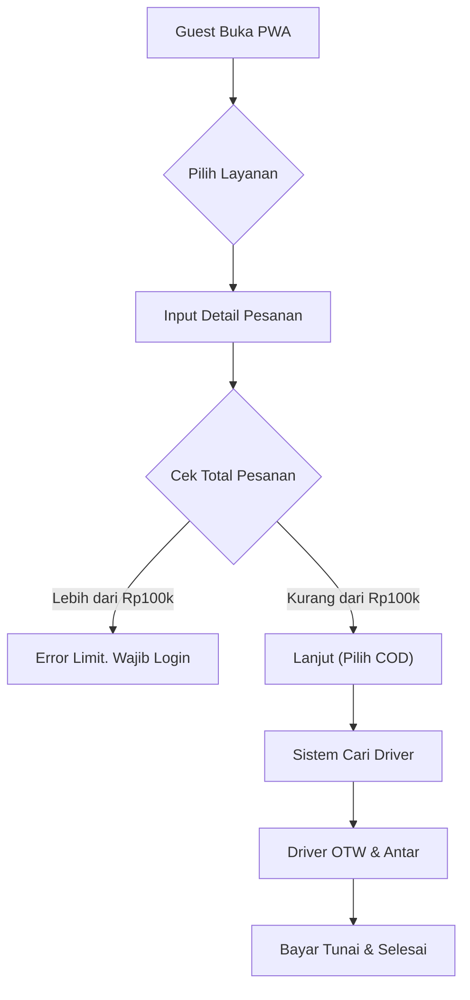
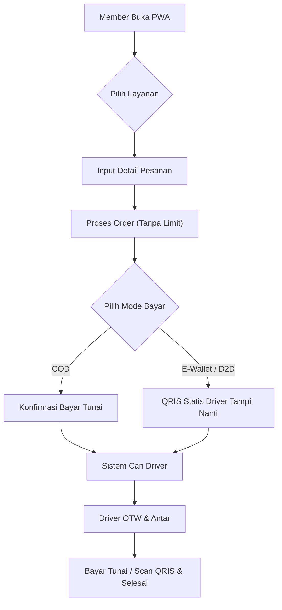
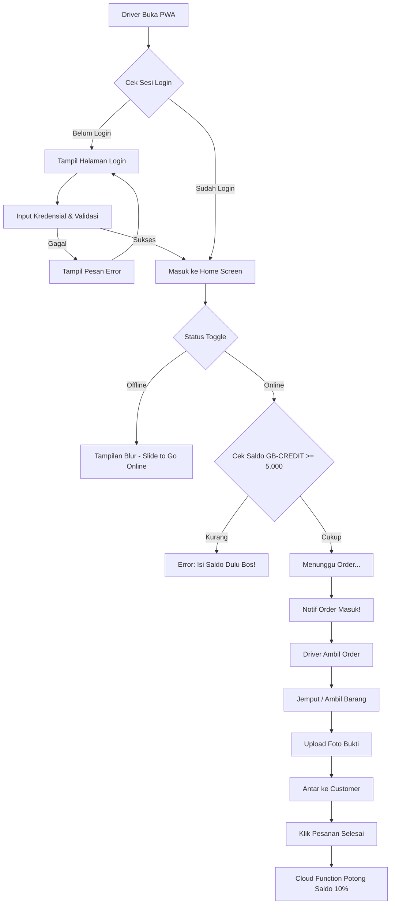

# GB Delivery: Frontend UI/UX & Navigation Plan

## User Review Required
> [!IMPORTANT]
> Mohon review proposal UI/UX dan struktur navigasi ini. Apakah ada screen atau flow tambahan yang terlewat dari PRD?

## 1. UI/UX Vision & Design System
Berdasarkan PRD, kita mengusung tema "Gen Z Aesthetic" dengan fokus "Minimal Click to Order".

### Color Palette
- **Background (Primary):** Midnight Blue (`#0A0A0A`) - Memberikan kesan sleek dan modern (Dark Mode default).
- **Accent/Action (Primary):** Cyber Lime (`#CCFF00`) - Untuk tombol utama (Order, Topup, Call to Action). Contrast tinggi pada dark mode.
- **Surface/Card:** Dark Gray/Surfaces (`#171717`, `#262626`) - Untuk kontainer menu, card order, dan modal.
- **Text:** Putih (`#FAFAFA`) & Abu-abu (`#A3A3A3`) untuk secondary text.
- **Error/Alert:** Coral Red (`#FF4B4B`) untuk validasi error/limit transaksi Guest.

### Typography
- Menggunakan font Sans-Serif modern dan clean seperti **Inter** atau **Outfit** (direkomendasikan dari Google Fonts).
- Ukuran teks besar dan bold untuk nomial harga dan status pesanan agar *scannable* (mudah dibaca sekilas).

### Key UX Principles (Minimal Click to Order)
- **Guest First:** Halaman utama langsung menampilkan layanan (Food, Ride, Send, Shopping) tanpa *forced login*. User bisa langsung eksplor.
- **Sticky Bottom Action:** Tombol "Pesan Sekarang" atau "Lanjut" selalu menempel di bawah (*sticky*) agar mudah dijangkau jempol sebelah tangan.
- **BottomSheet & Modals:** Mengurangi pindah-pindah halaman (*page reload*) dengan menggunakan *Bottom Sheet* yang muncul dari bawah layar untuk form alamat atau checkout.
- **Micro-interactions:** Animasi transisi halus saat klik menu, *shimmer effect* saat loading data map/resto (PWA serasa aplikasi Native).

---

## 2. Struktur Navigasi (Navigation Architecture)

Untuk kemudahan akses di *mobile/PWA*, kita akan menggunakan struktur **Bottom Navigation Bar**. Alur (flow) antara setiap role dipisah secara total menjadi tiga PWA/Domain yang berbeda:
- **Customer PWA:** `app.gbdelivery.id` (Fokus pada order & tracking)
- **Driver PWA:** `driver.gbdelivery.id` (Fokus pada job management & wallet)
- **Admin Dashboard:** `admin.gbdelivery.id` (Fokus pada monitoring, approval, & promo)
*Pemisahan ini memastikan bundle aplikasi tetap ringan, keamanan data antar role lebih terjaga, dan tim admin dapat bekerja di portal desktop yang terdedikasi.*

### A. Customer App Navigation

**1. Bottom Navigation Bar (Main Tabs)**
- 🏠 **Home:** Layanan utama (Food, Ride, Send, Shopping) & Promo banner/diskon ongkir.
- 📜 **Activity:** Riwayat pesanan & Pesanan aktif (Tracking real-time).
- 👤 **Profile:** Login/Member area, Pengaturan Alamat tersimpan, **Care Center (Pusat Bantuan)**.

**2. Screen Flow: Core Services**
- **Home Screen:**
  - Header: Pilihan Mode (Guest/Member - klik untuk ke page login), Lokasi saat ini, Sapaan hangat.
  - Hero Section: Banner Promo.
  - Grid Layanan: 4 Menu utama (GB FOOD 🍔, GB RIDE 🛵, GB SEND 📦, GB SHOPPING 🛒).
  
- **GB FOOD Flow:**
  - `Home` ➡️ `List Resto` ➡️ `Detail Resto & Menu (Emoji Rating 🔥)` ➡️ `BottomSheet Checkout (Pin Map, Validasi Limit 100k)` ➡️ `Tracking Order`.
  
- **GB RIDE Flow:**
  - `Home` ➡️ `Input Tujuan (Peta)` ➡️ `Pilih Titik Jemput` ➡️ `BottomSheet Checkout (Tampil Harga)` ➡️ `Tracking Order (Menunggu/Driver OTW)`.
  
- **GB SEND Flow:**
  - `Home` ➡️ `Form Detail Pengirim & Penerima` ➡️ `Detail Barang` ➡️ `Checkout` ➡️ `Tracking Order`.
  
- **GB SHOPPING Flow (Pesan Kustom - The Game Changer):**
  - `Home` ➡️ `Form Detail Toko & Barang` ➡️ `Input Link Maps/Alamat Manual` ➡️ `Estimasi Harga` ➡️ `Checkout` ➡️ `Driver OTW (Dana Talangan/Saldo)` ➡️ `Upload Struk (Update Harga Akhir)` ➡️ `Selesai`.

**3. Checkout & Tracking Screen**
- **Checkout:** Menggunakan drawer/bottom sheet. Sistem otomatis mengecek limit Guest (maks Rp100k) secara *real-time*.
- **Tracking Screen:** 
  - Bagian atas: Peta rute (Driver menuju lokasi).
  - Bagian bawah: Status Driver, Tombol WhatsApp (Share Journey), dan **QRIS Tampil otomatis** (Jika Member & Driver sedang jalan/D2D).

### B. Driver App Navigation

**1. Bottom Navigation Bar**
- 🗺️ **Job/Home:** Toggle Online/Offline, Peta lokasi.
- 💰 **Wallet:** Informasi Saldo `GB-CREDIT`, riwayat pemotongan fee 10%, info cara Top-up.
- 👤 **Profile:** Foto Profil, Update QRIS Upload, No E-Wallet.

**2. Driver Flow**
- `Offline Mode`: Tampilan blur/abu-abu, tombol besar *Slide to Go Online*. (Sistem validasi `GB-CREDIT` > Rp5.000).
- `Online Mode`: Menunggu order masuk sambil melihat map.
- `Incoming Order`: Layar berkedip/bunyi, Info Jarak, Estimasi Pendapatan bersih. Tombol "Ambil" atau "Abaikan".
- `Ongoing Job`: Arah navigasi, Tombol "Upload Bukti Foto", Tombol "Pesanan Selesai".

---

## 3. Visualisasi Alur & Wireframe

### A. Customer App

**Core Features:**
- **Guest Mode / Member Auth:** Akses instan (Guest) dengan limit transaksi Rp100k, atau Login Member (Firebase Auth) dengan limit *unlimited*.
- **Service Modules:** Katalog *GB FOOD* (**Menu Mandiri:** Disediakan sistem, tanpa portal resto terpisah), *GB RIDE* (Ojek), *GB SEND* (Kurir Barang), dan *GB SHOPPING* (Jastip Manual).
- **Interactive Maps & Pin Point:** Penentuan titik jemput dan antar menggunakan integrasi peta (Maps) yang akurat.
- **Real-time Order Tracking:** Pantau pergerakan *Driver* secara *real-time* dengan teknologi *Firestore Listeners*.
- **Dynamic Payment (D2D):** Mendukung metode *Cash on Delivery* (COD) dan pembayaran QRIS langsung transfer dari Customer ke Driver.
- **Crowdsourcing Database (Auto-Update):** Setiap inputan "Pesan Kustom" dari user akan otomatis masuk ke koleksi `merchants` Firestore dengan status `pending_review`. Membantu database toko tumbuh secara organik seiring penggunaan aplikasi.

**1. ASCII Wireframe (Guest vs Member Mode)**

*(Guest Mode: Tampilan basic, dengan tombol ajakan login)*
```text
+-------------------------+
| [Lokasi] Blitar Kota  v |
| 👤 Halo, Boss! (Guest)  |
| [ Login / Daftar ]      |
+-------------------------+
|       [BANNER PROMO]    |
|   Join Member Sekarang! |
+-------------------------+
| +-------+   +-------+   |
| |  🍔   |   |  🛵   |   |
| | FOOD  |   | RIDE  |   |
| +-------+   +-------+   |
| +-------+   +-------+   |
| |  📦   |   |  🛒   |   |
| | SEND  |   | SHOP  |   |
| +-------+   +-------+   |
+-------------------------+
|   🏠      📜      👤    |
|  Home  Activity Profile |
+-------------------------+
```

*(Member Mode: Menampilkan nama, badge, atau info tambahan)*
```text
+-------------------------+
| [Lokasi] Blitar Kota  v |
| 👑 Halo, Marco!         |
| 💰 Saldo / E-Wallet     |
+-------------------------+
|       [PROMO MEMBER]    |
|   Diskon Ongkir 50%!    |
+-------------------------+
| +-------+   +-------+   |
| |  🍔   |   |  🛵   |   |
| | FOOD  |   | RIDE  |   |
| +-------+   +-------+   |
| +-------+   +-------+   |
| |  📦   |   |  🛒   |   |
| | SEND  |   | SHOP  |   |
| +-------+   +-------+   |
+-------------------------+
|   🏠      📜      👤    |
|  Home  Activity Profile |
+-------------------------+

**3. ASCII Wireframe (Profile & Care Center)**
```text
+-------------------------+
| [X]       PROFILE       |
+-------------------------+
| 👤 Marco (Member)       |
| 📧 marco@email.com      |
+-------------------------+
| [🏠] Alamat Tersimpan   |
| [💳] Metode Pembayaran  |
+-------------------------+
| [🎧] CARE CENTER        |
|      (Hubungi Admin)    |
+-------------------------+
| [Log Out]               |
+-------------------------+
```
```

**2. Mermaid Flowchart (Guest vs Member Order Flow)**

*(Guest Order Flow - Limit Rp100k & Hanya COD)*


*(Member Order Flow - Unlimited & D2D Payment)*


### B. Driver App

**Core Features:**
- **Driver Authentication:** *Login portal* aman khusus untuk para mitra *Driver*.
- **Operational Status Toggle:** Tombol geser (*ON/OFF*) penerimaan *order*, dengan sistem penahanan (blokir sementara) jika saldo di bawah Rp5.000.
- **Live Job Map & Routing:** Peta layar penuh pendeteksi koordinat tugas dan integrasi rute navigasi.
- **Prepaid Wallet (GB-CREDIT):** Sistem dompet prabayar mitra yang terpotong otomatis 10% (*Admin Fee*) di akhir setiap penyelesaian pesanan.
- **Proof of Delivery (Camera Upload):** Fitur wajib unggah (*upload*) foto dari tangkapan kamera PWA untuk validasi pengambilan atau pengantaran barang.

**1. ASCII Wireframe (Driver Login)**
```text
+-------------------------+
|      [ LOGO GB ]        |
|     DRIVER PORTAL       |
+-------------------------+
|                         |
| Nomor HP / Email:       |
| [ ___________________ ] |
|                         |
| Kata Sandi / OTP:       |
| [ ___________________ ] |
|                         |
|   [ MASUK (LOGIN) ]     |
+-------------------------+
| Belum Gabung? Daftar  > |
+-------------------------+
```

**2. ASCII Wireframe (Home / Job Screen)**
```text
+-------------------------+
|  [💰] Saldo: Rp150.000  |
|  Status: [🔘 ON / OFF]  |
+-------------------------+
|                         |
|      (FULL SCREEN       |
|          MAP)           |
|                         |
|   🟢 OTW  👤 Customer   |
+-------------------------+
| [^] Swipe for detail    |
| - Jarak: 2 KM           |
| - Ongkir: Rp 20.000     |
+-------------------------+
|    [ AMBIL PHOTO ]      |
|  [ PESANAN SELESAI ]    |
+-------------------------+
|   🗺️      💰      👤    |
|  Job    Wallet  Profile |
+-------------------------+
```

**3. Mermaid Flowchart (Driver Login & Order System)**


### C. Admin Web Dashboard

**Core Features:**
- **Secure Admin Portal:** Pintu *login* khusus dan aman bagi pengelola operasional sistem.
- **Revenue & Transaction Dashboard:** Dasbor metrik pemantau total pendapatan platform dari pemotongan fee 10% serta statistik pesanan harian.
- **Top-up Saldo Manager:** Modul persetujuan (*approve/reject*) permintaan isi ulang saldo *GB-CREDIT Driver* sesudah validasi bukti transfer.
- **Promo & Subsidy Engine:** Pengatur voucher diskon, lengkap dengan mekanisme ganti-subsidi otomatis (*Cloud Functions*) dari Admin ke saldo Driver.
- **User & Merchant Management:** Sistem tata kelola *approval* akun mitra (*Driver*/Resto Baru) serta pemblokiran perangkat (*Device Ban*) bagi *Guest* bermasalah.

**1. ASCII Wireframe (Admin Login Page)**
```text
+-------------------------------------------------+
|                                                 |
|                 [ LOGO GB ]                     |
|            SUPER ADMIN DASHBOARD                |
|                                                 |
|             Username / Email:                   |
|             [ _______________ ]                 |
|                                                 |
|             Password:                           |
|             [ _______________ ]                 |
|                                                 |
|               [ SECURE LOGIN ]                  |
|                                                 |
+-------------------------------------------------+
```

**2. ASCII Wireframe (Dashboard Mode Desktop)**
```text
+-------------------------------------------------+
| 🚀 GB-ADMIN (Super Dashboard)          👤 Admin |
+---------+---------------------------------------+
| 📊 Dash | [  TOTAL PENDAPATAN FEE 10% ]         |
| 🚗 Drv  | [        Rp 2.500.000       ]         |
| 🍔 Food +---------------------------------------+
| 💰 Txn  |  [ REQUEST TOP UP DRIVER ]            |
| ⚙️ Set  | 1. Budi -> Rp 50.000   [APPROVE]      |
|         | 2. Andi -> Rp 100.000  [APPROVE]      |
+---------+---------------------------------------+
```

**3. Mermaid Flowchart (Admin Login & Workflow)**
```mermaid
flowchart TD
    Z["Admin Akses URL (/admin)"] --> Y{"Cek Sesi Admin"}
    Y -->|"Belum Login"| X["Tampil Halaman Login Admin"]
    X --> W["Input Auth (Email & Password)"]
    
    W -->|"Gagal"| V["Tampil Pesan Error Auth"]
    V --> X
    
    W -->|"Sukses (Role Admin)"| A["Masuk Dashboard Utama"]
    Y -->|"Sudah Login"| A

    A --> B{"Pilih Menu di Sidebar"}
    
    B -->|"Kelola Promo"| C["Set Subsidi Promo"]
    B -->|"Kelola Driver"| D["Validasi Top-Up Bank via WA"]
    B -->|"Pendaftaran"| E["Approve Driver / Resto Baru"]
    
    D --> F["Klik Approve Top-Up"]
    F --> G["Cloud Function Tambah Saldo Driver"]
    
    C --> H["Order Baru dengan Promo User"]
    H --> I["User Bayar Diskon -> Admin Fee 0% -> Admin subsidi saldo driver"]

**4. Remote Control & Onboarding**
- **Centralized Settings:** Pengaturan tarif per KM, tarif minimum, dan biaya layanan dapat diubah secara *real-time* via Dashboard tanpa update kode.
- **Manual Driver Onboarding:** Driver tidak mendaftar sendiri di aplikasi. Admin melakukan input data driver (setelah seleksi fisik kendaraan & dokumen) langsung dari Dashboard.
- **Admin Security:** Akses terkunci menggunakan Firebase Auth dengan pengecekan `role: "admin"` pada custom claims.
```

---

## 4. Fondasi Utama (Tech Stack) & UI
Untuk memastikan performa "Sat-set" dan hemat biaya pengembangan, kita menggunakan kombinasi:

1. **Framework:** **Vite + React** (Pilihan paling cerdas: Ringan, gratis, dan performa PWA-nya maksimal untuk HP).
2. **Styling:** **Tailwind CSS** (Mempercepat pembuatan UI yang konsisten dengan utility classes).
3. **Icons:** **Lucide React** (Ikon modern yang ringan untuk motor, paket, dll).
4. **Interactive Components:** 
   - **`BottomSheet` (Vaul):** Drawer yang swipeable untuk form alamat/checkout.
   - **`StatusBadge`:** Label status interaktif (Kuning = Pending, Biru = Diambil, Hijau = Selesai).

## 6. Technical Infrastructure & Mobile Experience

### A. Fitur PWA (Mobile Experience)
- **Plugin:** `vite-plugin-pwa`.
- **Keunggulan:** Aplikasi bisa di-install di HP (*Add to Home Screen*), mendukung *Offline Mode*, dan loading instan (Caching static assets) meski sinyal di Blitar tidak stabil.
- **Push Notifications:** Menggunakan Firebase Cloud Messaging (FCM) untuk notifikasi orderan baru dan update status.

### B. Sistem Peta & Navigasi (Maps)
- **Library:** `Leaflet.js` + `react-leaflet` (Gratis total, ringan, tanpa kartu kredit).
- **Routing:** `Leaflet Routing Machine` (Untuk menggambar rute di internal aplikasi & menghitung jarak KM untuk penentuan ongkir otomatis).
- **Hybrid Maps Strategy:** 
  - **Internal:** Gunakan Leaflet untuk presisi harga dan tampilan di sisi User.
  - **External:** Sisi Driver dibekali tombol **"Buka Navigasi Google Maps"**. Klik tombol ini akan memicu *Google Maps Intent* (melempar koordinat ke aplikasi Google Maps asli di HP). Akurasi 100% Google Maps secara GRATIS.

### C. Backend & Real-time Tracking (Hemat Biaya)
- **Database:** Firebase Spark Plan (Gratis).
- **Firestore:** Penyimpanan data order, profil, dan riwayat transaksi.
- **Auth:** Google Login & Email (User-friendly dan gratis selamanya).
- **Storage:** Simpan foto bukti paket, struk belanja, atau QRIS driver.
- **Real-time Tracking:**
  - **Pusher (WebSocket):** Digunakan untuk update lokasi kurir tiap 5 detik di peta user (Cepat & gratis s.d 200rb pesan/hari).
  - **Firebase Sync:** Posisi kurir sukses disimpan ke database hanya tiap 1 menit sekali atau saat status berubah (Hemat jatah *Writes* Firebase).
  - **Trik Baterai:** Update lokasi dipicu hanya jika kurir bergerak > 10 meter (Hemat kuota & baterai driver).

### D. Penanganan Kasus Ekstrem
- **Anti-Ghosting:** Jika driver sudah status "Otw Jemput", pembatalan Guest akan dikunci. Pelanggaran berulang = *Device ID Blacklist*.
- **Auto-Reassign:** Jika driver batal darurat, status order kembali menjadi *Pending* untuk diambil driver lain di area terdekat.

## 7. Strategi Bisnis & Monetisasi (Cuan Stream)
- **Mark-up Harga Otomatis:** Sistem secara otomatis menaikkan harga menu (misal +Rp2.000) dari harga asli warung sebagai *direct revenue* platform, tanpa perlu repot menagih komisi ke pemilik warung di awal.
- **WhatsApp Notification Integration:** Mengingat sistem notifikasi kompleks memakan waktu build, gunakan *WhatsApp Link API* otomatis untuk memberi tahu penjual/driver jika ada orderan baru yang masuk.

## 8. Keputusan Arsitektur Final
- **Framework:** Vite + React (Sat-set & Ringan).
- **Styling:** Tailwind CSS + Lucide Icons.
- **Maps Provider:** Hybrid (Leaflet + Google Maps Intent).
- **Backend:** Firebase Spark (Gratis) + Pusher (Real-time).
- **Driver App:** PWA Mandiri (Vite).
- **Admin Dashboard:** PWA/Web Mandiri (Vite).
- **Guest History:** Local Storage (Browser).

## Verification Plan
1. **Visual Proposal:** Jika di-approve, saya bisa generate gambar mock-up UI menggunakan *tool AI image generation* untuk memvisualisasikan bagaimana warna "Cyber Lime" dan "Midnight Blue" berpadu.
2. **Next Step:** Menyiapkan inisialisasi *codebase* Vite + React, Setup Tailwind, dan menyusun routing strukturnya.
